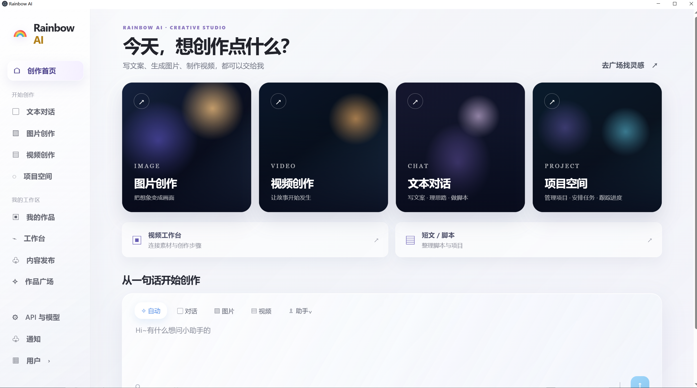
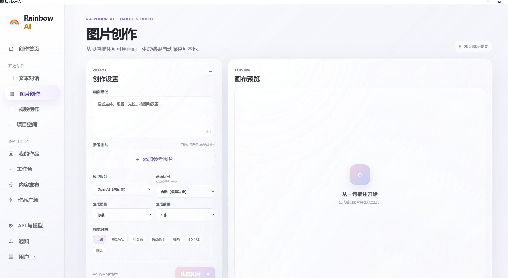
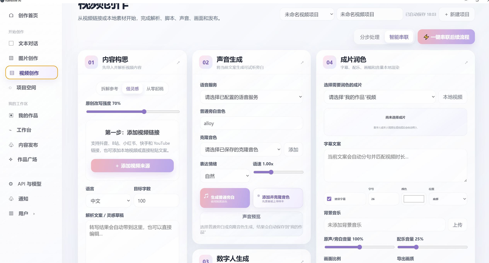
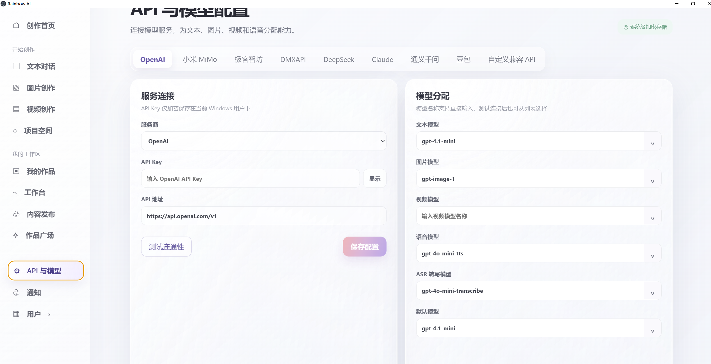
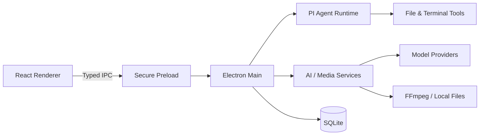

<div align="center">
  
  <h1>Rainbow AI</h1>
  <p><strong>面向内容创作者的本地优先多模态 AI 工作台</strong></p>
  <p>对话、图片、语音、视频、数字人与内容发布，在一个桌面应用中完成。</p>

  <p>
    <a href="https://github.com/hongbangqin-1205/rainbow-ai/actions/workflows/ci.yml"></a>
    
    
    
    
    
  </p>
</div>

## ✨ 核心能力

| 模块 | 能力 |
| --- | --- |
| **对话与 Agent** | 普通对话与 PI Agent 操作双模式；支持文件工具、终端工具、三级权限和执行审批 |
| **多模型配置** | 统一管理文本、图片、视频、TTS 与 ASR 模型；兼容 Responses、Chat Completions、Claude Messages |
| **视频创作** | 在线/本地素材解析、API ASR 转写、文案构思、旁白生成、数字人、口型同步与成片润色 |
| **作品中心** | 统一管理文本、图片、音频和视频，支持搜索、标签、收藏、项目关联、备份与再次创作 |
| **项目协作** | 项目、任务、作品与创作来源关联，保留任务状态和执行记录 |
| **内容发布** | 支持多个内容平台的账号授权、发布校验和浏览器辅助发布 |

## 🖼️ 产品界面

<table>
  <tr>
    <td width="50%"><strong>创作首页</strong><br /></td>
    <td width="50%"><strong>图片创作</strong><br /></td>
  </tr>
  <tr>
    <td width="50%"><strong>视频创作</strong><br /></td>
    <td width="50%"><strong>API 与模型配置</strong><br /></td>
  </tr>
</table>

## 🧠 PI Agent 权限模型

Rainbow AI 将对话能力和本地执行能力放在同一工作区，但由宿主应用强制控制工具权限。

| 模式 | 行为 |
| --- | --- |
| **每次询问** | 文件修改和终端命令执行前均需确认 |
| **智能批准** | 项目目录内修改可自动执行，终端及项目外操作仍需确认 |
| **完全访问** | 工具直接执行，适合用户本人控制的可信环境 |

支持 `read`、`grep`、`find`、`ls`、`write`、`edit`、`bash` 与 `powershell` 等工具，并记录 Agent 运行与步骤状态。

## 🏗️ 架构



- **渲染层：** React 19 + TypeScript，承载 11 个业务页面。
- **桌面层：** Electron 主进程集中管理窗口、文件系统、任务调度与 110 个 IPC 处理入口。
- **数据层：** SQLite 维护 25 张业务表，启用 WAL、外键、事务与查询索引。
- **服务层：** 聊天、图片、语音、视频、数字人、发布和存储能力按服务拆分。

## 🔌 模型与协议

内置 OpenAI、DeepSeek、Claude、通义千问、豆包、小米 MiMo、极客智坊、DMXAPI 及自定义兼容 API 配置入口。

- OpenAI Responses API
- OpenAI-compatible Chat Completions
- Anthropic Claude Messages
- 独立的文本、图片、视频、语音和 ASR 模型分配
- 超时、重试、流式响应与连接测试

> 第三方模型是否可用取决于服务商账号、模型权限及对应 API 协议。

## 🚀 本地开发

### 环境要求

- Node.js 20+
- pnpm 9+
- Windows 10/11（当前主要支持平台）

### 启动

```bash
pnpm install
pnpm dev
```

### 检查与构建

```bash
pnpm typecheck
pnpm build
```

模型密钥通过应用内的「API 与模型配置」录入，无需写入源码。`.env.example` 仅用于兼容早期扩展配置。

## 🛡️ 数据与安全

- API Key 与平台授权信息存储在 Electron 用户数据目录，并通过 Windows `safeStorage` 加密。
- 作品和数据库默认保存在本机，支持迁移到用户指定磁盘。
- 付费异步视频任务保存请求 ID、参数指纹和上游任务 ID，用于防重复提交及重启恢复。
- 仓库忽略本地数据库、Cookie、环境变量、生成媒体、缓存和构建产物。
- 平台发布采用浏览器辅助流程；验证码、审核和最终提交仍由用户在官方页面完成。

## 🗺️ 后续计划

- [ ] 完善自动化测试与端到端测试覆盖
- [ ] 增加更多视频与数字人服务商适配器
- [ ] 优化长任务队列、断点恢复与任务通知
- [ ] 提供可签名的 Windows 安装包与自动更新

## 📁 项目结构

```text
src/
├─ main/       # Electron 主进程、SQLite 与业务服务
├─ preload/    # 受控 IPC 桥接
├─ ui/         # React 业务页面
├─ agent/      # Agent 工具与视频 Agent
├─ assets/     # 品牌资源
├─ app.tsx     # 应用路由与页面编排
└─ *.css       # 全局设计系统与页面样式
```

---

<div align="center">
  <sub>Built for a local-first, controllable AI creation workflow.</sub>
</div>
